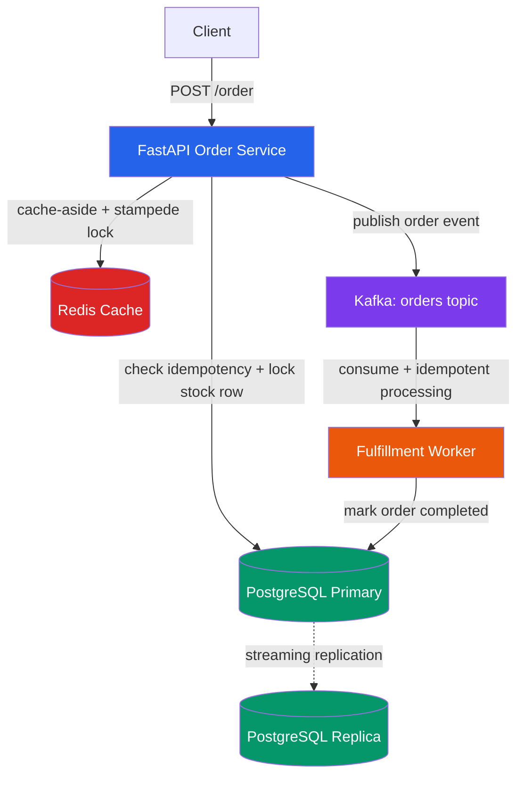

# FORGE — Distributed Order Processing System

**A backend engine that guarantees correct order processing under real failure conditions — database crashes, worker failures, cache stampedes, and concurrent load — without losing, duplicating, or corrupting a single order.**

---

## What is FORGE?

FORGE is not another e-commerce app. It's the invisible backbone that platforms like Amazon, Flipkart, and Zepto rely on internally — the engine that answers one deceptively hard question:

> **"When an order is placed, how do you guarantee it's fulfilled exactly once — even when the database crashes, the network glitches, or a thousand requests arrive at the same millisecond?"**

This project implements and *stress-tests* the real engineering patterns used to solve that problem: idempotency, distributed caching, event-driven decoupling via Kafka, and database replication — each one verified under actual concurrent load and simulated failure, not just written and assumed to work.

---

## Architecture

**Flow:** A client places an order → the API checks for duplicates and locks the relevant stock row → the order is committed to PostgreSQL → the cache is invalidated → an event is published to Kafka → a separate fulfillment worker picks it up independently and marks it complete. Every arrow above is a point where the system has been deliberately broken and tested for correct recovery.

---

## Verified engineering guarantees

Every claim below has been tested, not just implemented — see `Testing` section for how to reproduce each one.

| Guarantee | How it's enforced | How it was verified |
|---|---|---|
| **No duplicate orders** | Idempotency key + `INSERT ... ON CONFLICT` (DB-level atomicity) | 10 concurrent identical requests → exactly 1 order created |
| **No overselling** | `SELECT ... FOR UPDATE` row locking | 10 concurrent requests for 1 unit of stock → exactly 1 succeeds |
| **No cache stampede** | Redis distributed lock (`SET NX EX`) on cache miss | 15 concurrent requests on cold cache → only 1 reaches PostgreSQL |
| **No lost orders on worker crash** | Kafka manual offset commit (`enable.auto.commit: False`) | Worker killed mid-processing → order reprocessed correctly on restart |
| **No duplicate fulfillment on replay** | Consumer-side idempotency check before processing | Kafka offset manually reset (19 messages replayed) → 0 duplicate side effects |
| **Data survives primary DB crash** | PostgreSQL streaming replication (primary → replica) | Data inserted on primary appears on replica with zero manual steps |
| **Clean failure under chaos** | Transactional integrity + connection error handling | 50 concurrent orders fired, primary DB killed mid-test → orders before crash succeed, orders during/after fail cleanly (no corruption), system self-recovers after DB restart |

---

## Tech stack

| Layer | Technology |
|---|---|
| API | Python, FastAPI, Uvicorn |
| Database | PostgreSQL 16 (primary-replica streaming replication) |
| Caching | Redis 7 |
| Messaging | Apache Kafka + Zookeeper (Confluent images) |
| Infra | Docker, Docker Compose |
| Testing | Custom Python scripts using `threading` + `requests` |

---

## Project structure
